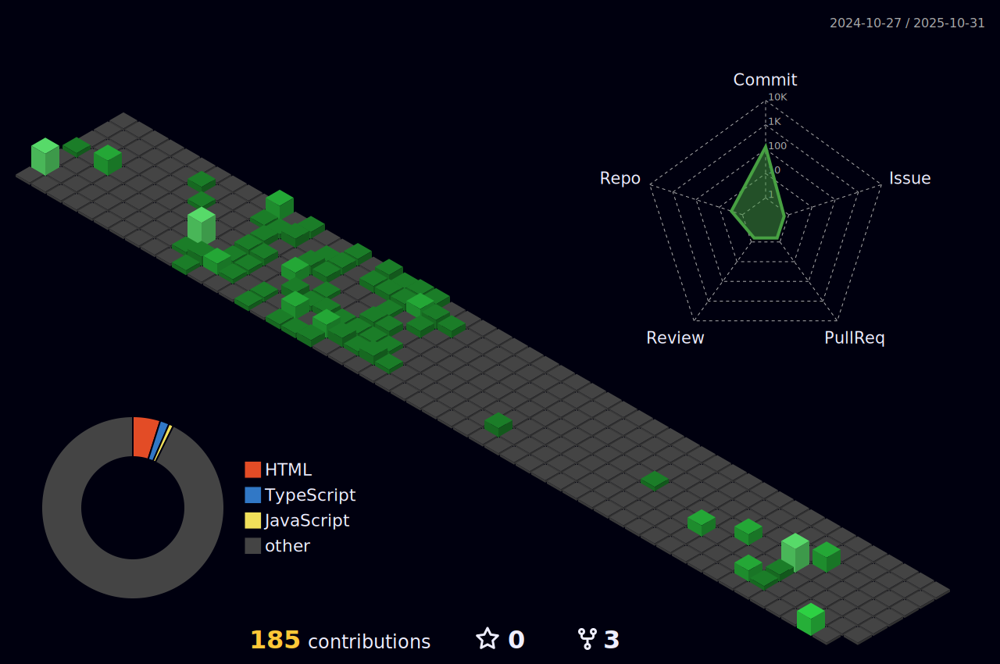

### 
Hey  I'm Kim-Seong-Hyeon PR

  

### 
 My tech stack

  
   

 

 

 

   

 

 

   

 

  

	 

### Social Media:
 

  <a href="https://github.com/rtg1014"><a/>
  <a href="mailto:rtg1014@gmail.com?subject=Github profile Visit"><a/>
<a href="mailto:rtg1014@gmail.com?subject=Github profile Visit"><a/>
	  
	  
	  

	  
	  
	  

### Github Stats:

 |  
:-------------------------:|:-------------------------:
 |  

### Github contribution:
	  
<h4 align="center">My contribution graph</h4>

<h4 align="center">Watch my contribution graph get eaten by the snake 🐍</h4>

    
<h4 align="center">Isometric view of contributions in the last year.</h4>

	

	
